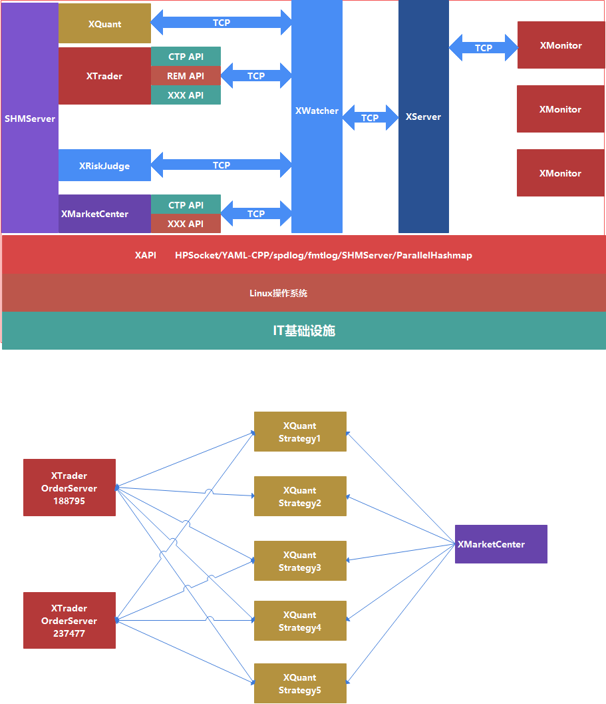

# QuantFabric量化交易系统
## QuantFabric简介
- QuantFabric是基于Linux/C++开发的中高频量化交易系统，支持中金所、郑商所、大商所、上期所、上海国际能源中心的期货业务品种交易，支持上交所、深交所的股票、债券品种交易。
- QuantFabric目前支持期货交易柜台如下：
  - CTP
  - 盛立REM
  - 易达YD
- QuantFabric目前支持股票交易柜台如下：
  - 宽睿OES

- QuantFabric计划支持股票交易柜台如下：
  - 中泰XTP
  - 华鑫奇点
  - 华锐ATP

- QuantFabric量化交易系统架构如下：


- GitHub：[QuantFabric](https://github.com/QuantFabric/QuantFabric)


## 编译构建
### QuantFabric
- **登录GitCode或GitHub，增加SSH Key认证方式**。
- QuantFabric量化交易系统下载：
```bash
git clone --recursive git@github.com:QuantFabric/QuantFabric.git
```

- QuantFabric编译构建：

```bash
cd QuantFabric			# 进入QuantFabric目录
git submodule init		# 初始化子模块
git submodule update --remote	# 更新子模块
sh build_release.sh		# 编译构建
```

- 编译构建完成时，可执行文件和so文件位于build目录下。

- 单个子模块更新代码：

```bash
cd XMonitor
git pull origin master
```

- 多个子模块遍历更新代码：

```bash
git submodule update --remote
git submodule foreach 'git pull origin master'
```

### XMonitor
- GUI客户端XMonitor编译构建流程如下：
```bash
  cd XMonitor				# 进入XMonitor目录
  git pull
  git submodule init		# 初始化子模块
  git submodule update --remote	# 更新子模块
  mkdir build
  cd build
  qmake ..
  make
```
- 编译完成时，可执行文件位于build目录下。
- 由于CMake对于Qt工程构建不完美，本人仍然使用qmake对XMonitor进行单独编译构建。如果需要使用CMake构建XMonitor，请参看[CMake构建Qt工程实践](https://quantfabric.blog.csdn.net/article/details/123077371)。

## QuantFabric模块
### Utils
- 基础工具模块，提供交易系统不同组件共用的工具模块，如配置加载模块、HPPackClient客户端、HPPackServer服务端、SQLiteManager数据库操作、Singleton单例、Logger日志、RingBuffer、LockFreeQueue无锁队列、IPCMarketQueue行情消息队列、IPCLockFreeQueue内存队列、SnapShotHelper快照工具、时间戳函数、字符串工具函数、不同组件消息通信协议。
- 项目地址：[Utils](https://github.com/QuantFabric/Utils)

### XAPI
- 第三方库，包括SPDLog日志库、HPSocket通信框架、YAML-CPP解析库、CTP柜台API、REM柜台API、YD柜台API、ConcurrentQueue并发队列、OES柜台API。
- 项目地址：[XAPI](https://github.com/QuantFabric/XAPI)

### XServer
- 中间件，主要功能如下：
  - 转发GUI客户端上行控制命令到不同Colo交易服务器，如转发XMonitor的报单撤单请求消息到XTrader、风控控制命令消息至XRiskJudge；
  - 转发交易相关数据到GUI客户端，如转发XMarketCenter行情数据、XTrader订单回报至XMonitor。
  - 管理XMonitor客户端登录用户的权限校验。
  - 盘后提供历史数据回放。
- 项目地址：[XServer](https://github.com/QuantFabric/XServer)

### XWatcher
- 监控组件，提供Colo交易服务器上部署的交易组件的监控，并负责转发数据。主要功能如下：
  - 转发XServer转发的控制命令，如报单、撤单、风控参数修改等。
  - 转发Colo交易进程如XMarketCenter、XTrader、XRiskJuage等交易、监控数据至XServer。
  - 监控Colo交易服务器实时性能指标、App交易进程状态，并将相应状态转发至XServer。
- 项目地址：[XWatcher](https://github.com/QuantFabric/XWatcher)

### XMarketCenter
- 行情网关，采用插件架构，适配不同Broker柜台行情API，主要功能如下：
  - 收取行情数据；
  - 打包行情切片数据写入共享内存队列；
  - 行情数据落地；
  - 行情数据转发至XWatcher监控组件。
- 项目地址：[XMarketCenter](https://github.com/QuantFabric/XMarketCenter)

### XRiskJudge
- 风控系统，主要功能如下：
  - 提供账户间风控，如流速控制、账户锁定、自成交、撤单限制检查等风控功能；
  - 加载风控参数，解析XServer转发的风控控制命令，更新风控参数，发送风控参数至XWatcher；
  - 接收XTrader报单、撤单请求，进行风控检查，发送风控检查结果至XTrader；
  - 接收XTrader报单回报、撤单回报，管理订单状态，Ticker交易日内累计撤单计数。
- 项目地址：[XRiskJudge](https://github.com/QuantFabric/XRiskJudge)

### XTrader
- 交易网关，采用插件架构适配不同Broker柜台交易API，主要功能如下：
  - 从网络客户端收取手动报单、撤单请求。
  - 从Order内存队列读取报单、撤单请求。
  - 执行报单、撤单指令，管理订单回报。
  - 将仓位、资金、订单回报写入Report内存队列。
  - 将仓位、资金、订单回报发送至XWatcher。
- 项目地址：[XTrader](https://github.com/QuantFabric/XTrader)

### Tools
- 工具箱，提供工具如下：
  - OrderSend：提供批量报单功能，订单写入内存队列。
  - MarketReader：提供行情数据导出功能，从内存行情队列导出行情数据。
- 项目地址：[Tools](https://github.com/QuantFabric/Tools)

### FinTechUI
- 基于Qt封装的金融科技UI组件，支持冻结列TableView、多层次表头HeaderView、自定义排序过滤模型、自定义Button代理、自定义Progress代理、自定义ComboBox代理、自定义表格模型XTableModel、可拖拽式UI插件框架。
- 项目地址：[FinTechUI](https://github.com/QuantFabric/FinTechUI)

### XMonitor
- GUI监控客户端，功能特性如下：
  - 通过拖拽式插件架构实现不同插件页的分屏幕显示，为交易、策略、IT生产运维等人员提供良好GUI体验；
  - 提供Colo交易服务器实时性能指标和交易组件进程状态有效监控；
  - 提供交易组件的进程级管理，实现GUI客户端启动、停止交易组件；
  - 提供行情数据展示、订单回报管理、报单、撤单、风控管理、用户权限管理、交易进程管理等功能。
- XMonitor客户端提供Permission、Market、EventLog、Monitor、RiskJudge、OrderManager等插件，用于展示不同监控信息。
- 项目地址：[XMonitor](https://github.com/QuantFabric/XMonitor)
- Permission插件：提供用户插件权限管理，消息数据订阅。如下：


- Market插件：展示所有接收Ticker的行情数据。如下：


- EventLog插件：展示交易系统所有组件的事件日志。如下：


- Monitor插件：展示Colo交易服务器实时性能指标，交易进程实时状态，提供交易进程管理功能。如下：


- RiskJudge插件：提供风控系统流速限制、Ticker撤单限制、订单撤单限制相关参数设置；提供账户锁定功能；展示不同账户不同Ticker的累计撤单次数；展示风控系统事件日志。如下：


- OrderManager插件：提供报单、撤单功能；展示账户仓位信息；展示账户挂单信息；展示账户历史订单记录；展示账户资金信息。如下：


## 参考资料
- **[《QuantFabric量化交易系统构建实践》课程](https://study.163.com/course/courseMain.htm?courseId=1212500814&share=2&shareId=480000002281617)**
- **[《量化IT》专栏](https://blog.csdn.net/a642960662/category_11641151.html)**
- **[《Linux性能优化》专栏](https://blog.csdn.net/a642960662/category_11641226.html)**
- **[《Qt开发》专栏](https://blog.csdn.net/a642960662/category_11657198.html)**
- **量化IT技术QQ群：748930268**，加群验证码：QuantFabric

## QuantFabric会员服务
- 基于**代码开源，服务收费**原则，QuantFabric会进行开源，同时会推出QuantFabric会员服务。
- QuantFabric会员服务权利：
  - 1、会员将可享加入QuantFabric会员服务微信群，享受技术支持服务。工作时间段可能存在回复不及时情况。
  - 2、会员享提前学习QuantFabric新增功能的权利，新增功能通常将在开发完成后3至6个月进行开源。
  - 3、会员在非工作时间可享一对一语音指导服务，次数受限，需提前预约。
  - 4、会员服务时间期限1年，暂只针对个人提供，目前定价1200元/年，暂不提供发票。会员续费目前只能在会员服务期满前1个月进行续费。
  - 5、购买《QuantFabric量化交易系统构建实践》课程将赠送QuantFabric会员服务1年。
  - 6、购买《HFTrader高频交易系统构建实践》课程（尚未推出）将赠送QuantFabric会员服务1年。
  - 7、同时购买《QuantFabric量化交易系统构建实践》课程和《HFTrader高频交易系统构建实践》课程（尚未推出），则会员服务期限可累加，可享2年QuantFabric会员服务。
  - 8、QuantFabric课程和QuantFabric会员服务价格将视QuantFabric增加功能进行适当提价。
  - 9、针对购买QuantFabric课程的在读大专生、本科生、研究生、博士生以及毕业一年内学生，如果因为IT基础薄弱，需要延长会员服务期限的，可以申请延长，经审核通过，最多可以延长6个月。
  - 10、服务推荐：IT基础薄弱人员，建议购买QuantFabric课程进行学习；非量化行业的IT从业人员，建议购买QuantFabric课程或购买会员服务。