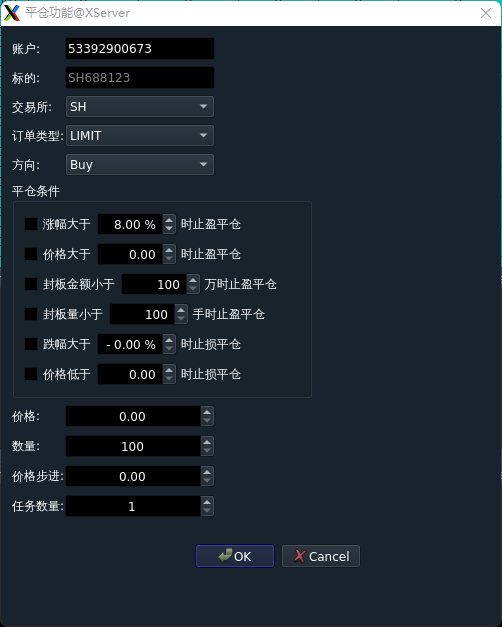

## QuantFabric开发学习参考资料
- **[《量化IT工程师实战》课程](https://lhitjs.360dhf.cn/video)**
- **[《量化IT》专栏](https://blog.csdn.net/a642960662/category_11641151.html)**
- **[《Linux性能优化》专栏](https://blog.csdn.net/a642960662/category_11641226.html)**
- **[《Qt开发》专栏](https://blog.csdn.net/a642960662/category_11657198.html)**
- **量化IT技术QQ群：748930268**，加群验证码：QuantFabric


## QuantFabric量化交易系统
### QuantFabric简介
- QuantFabric是基于Linux C++/Python开发的中高频量化交易系统，支持中金所、郑商所、大商所、上期所、上海国际能源中心的期货业务品种交易，支持上交所、深交所的股票、债券品种交易。
- QuantFabric目前支持期货交易柜台如下：
  - CTP
  - 盛立REM
  - 易达YD
- QuantFabric目前支持股票交易柜台如下：
  - 宽睿OES


- QuantFabric量化交易系统架构如下：


- XServer、XMonitor是QuantFabric量化交易系统的公共基础设施。
- XWatcher、XMarketCenter、XRiskJudge、XTrader、XQuant部署在交易服务器，XWatcher、XMarketCenter、XRiskJudge、XTrader开盘前启动后运行直至收盘，XQuant则根据日内交易策略随时在盘中可以进行启动、停止。

- GitHub：[QuantFabric](https://github.com/QuantFabric/QuantFabric)


### 编译构建
#### QuantFabric
- **登录GitCode或GitHub，增加SSH Key认证方式**。
- **QuantFabric量化交易系统下载**：
  ```bash
  git clone --recurse-submodules git@github.com:QuantFabric/QuantFabric.git
  ```

- **安装SQLite3开发工具包**：
  ```bash
  yum install sqlite-devel
  ```

- **QuantFabric编译构建**：

  ```bash
  cd QuantFabric			# 进入QuantFabric目录
  git submodule init		# 初始化子模块
  git submodule update --remote	# 更新子模块
  sh build_release.sh		# 编译构建
  ```

- 编译构建完成时，可执行文件和so文件位于build目录下。

#### Ubuntu
- 如果在Ubuntu系统下编译报错信息：
    
- 解决方案：
  - 1、检查YAML-CPP库文件是否存在
  ```bash
  ls -la ${CMAKE_CURRENT_SOURCE_DIR}/../XAPI/YAML-CPP/0.8.0/lib/
  ```
  - 确保使用正确的库文件名，使用完整库文件路径替换编译
  ```cmake
  target_link_libraries(${HFTrader_Version} 
    pthread 
    hpsocket4c 
    ${CMAKE_CURRENT_SOURCE_DIR}/../XAPI/YAML-CPP/0.8.0/lib/libyaml-cpp.a  
    dl
    )
  ```
  - 添加YAML-CPP依赖项
  ```cmake
  target_link_libraries(${HFTrader_Version} 
    pthread 
    hpsocket4c 
    dl
    # ... 其他交易API库
    yaml-cpp  # 将 yaml-cpp 移到最后
    )
  ```
  - 重新编译YAML-CPP
  ```bash
  cd ${CMAKE_CURRENT_SOURCE_DIR}/../XAPI/YAML-CPP/0.8.0/
  mkdir build
  cd build
  cmake .. -DCMAKE_CXX_FLAGS="-D_GLIBCXX_USE_CXX11_ABI=0"  # 与主项目一致的ABI设置
  make
  ```
  - 使用find_package查找
  ```cmake
  find_package(yaml-cpp REQUIRED)
  target_link_libraries(${HFTrader_Version} yaml-cpp)
  ```
  - 检查符号是否存在
  ```bash
  nm -C ${CMAKE_CURRENT_SOURCE_DIR}/../XAPI/YAML-CPP/0.8.0/lib/libyaml-cpp.a | grep "YAML::LoadFile"
  ```

  - 可以根据上述解决方法依次尝试解决，每次尝试确保清理并重新构建项目。根据实践，大部分情况下错误原因是ABI兼容问题引发，需要重新编译YAML-CPP，编译时指定`-D_GLIBCXX_USE_CXX11_ABI=0`；

  - 注：可以将错误信息截图和CMakeLists.txt内容上传至DeepSeek，由DeepSeek给出解决方案。


#### XMonitor
- GUI客户端XMonitor编译构建流程如下：
```bash
  cd XMonitor				# 进入XMonitor目录
  git pull
  git submodule init		# 初始化子模块
  git submodule update --remote	# 更新子模块
  mkdir build
  cd build
  qmake ..
  make
```
- 编译完成时，可执行文件位于build目录下。
- 由于CMake对于Qt工程构建不完美，本人仍然使用qmake对XMonitor进行单独编译构建。如果需要使用CMake构建XMonitor，请参看[CMake构建Qt工程实践](https://quantfabric.blog.csdn.net/article/details/123077371)。

### QuantFabric模块
#### Utils
- 基础工具模块，提供交易系统不同组件共用的工具模块，如配置加载模块、HPPackClient客户端、HPPackServer服务端、SQLiteManager数据库操作、Singleton单例、Logger日志、RingBuffer、LockFreeQueue无锁队列、IPCMarketQueue行情消息队列、IPCLockFreeQueue内存队列、SnapShotHelper快照工具、时间戳函数、字符串工具函数、不同组件消息通信协议。
- 项目地址：[Utils](https://github.com/QuantFabric/Utils)

#### XAPI
- 第三方库，包括SPDLog日志库、HPSocket通信框架、YAML-CPP解析库、CTP柜台API、REM柜台API、YD柜台API、ConcurrentQueue并发队列、OES柜台API。
- 项目地址：[XAPI](https://github.com/QuantFabric/XAPI)

#### XServer
- 中间件，主要功能如下：
  - 转发GUI客户端上行控制命令到不同Colo交易服务器，如转发XMonitor的报单撤单请求消息到XTrader、风控控制命令消息至XRiskJudge；
  - 转发交易相关数据到GUI客户端，如转发XMarketCenter行情数据、XTrader订单回报至XMonitor。
  - 管理XMonitor客户端登录用户的权限校验。
  - 盘后提供历史数据回放。
- 项目地址：[XServer](https://github.com/QuantFabric/XServer)

#### XWatcher
- 监控组件，提供Colo交易服务器上部署的交易组件的监控，并负责转发数据。主要功能如下：
  - 转发XServer转发的控制命令，如报单、撤单、风控参数修改等。
  - 转发Colo交易进程如XMarketCenter、XTrader、XRiskJuage等交易、监控数据至XServer。
  - 监控Colo交易服务器实时性能指标、App交易进程状态，并将相应状态转发至XServer。
- 项目地址：[XWatcher](https://github.com/QuantFabric/XWatcher)

#### XMarketCenter
- 行情网关，采用插件架构，适配不同Broker柜台行情API，主要功能如下：
  - 收取行情数据；
  - 行情数据写入共享内存队列；
  - 行情数据转发至XWatcher监控组件。
- 项目地址：[XMarketCenter](https://github.com/QuantFabric/XMarketCenter)

#### XRiskJudge
- 风控系统，主要功能如下：
  - 提供账户间风控，如流速控制、账户锁定、自成交、撤单限制检查等风控功能；
  - 加载风控参数，解析XServer转发的风控控制命令，更新风控参数，发送风控参数至XWatcher；
  - 接收XTrader报单、撤单请求，进行风控检查，发送风控检查结果至XTrader；
  - 接收XTrader报单回报、撤单回报，管理订单状态，Ticker交易日内累计撤单计数。
- 项目地址：[XRiskJudge](https://github.com/QuantFabric/XRiskJudge)

#### XTrader
- 交易网关，采用插件架构适配不同Broker柜台交易API，主要功能如下：
  - 从网络客户端收取手动报单、撤单请求。
  - 从共享内存队列读取报单、撤单请求。
  - 执行报单、撤单指令，管理订单回报。
  - 将仓位、资金、订单回报写入共享内存队列。
  - 将仓位、资金、订单回报发送至XWatcher。
- 项目地址：[XTrader](https://github.com/QuantFabric/XTrader)


#### XDataPlayer
- 行情数据转发组件，用于将XServer接收的行情数据分发到无行情服务的交易服务器，提供交易使用，或回放CSV行情数据文件。
- 项目地址：[XDataPlayer](https://github.com/QuantFabric/XDataPlayer)


#### XTest
- XTest是QuantFabric量化交易系统的测试用例集合，可以作为QuantFabric开发和学习过程中测试使用，所使用测试环境为不同柜台厂商提供的仿真测试环境，可以直接运行。主要组件如下：
    - XServer：QuantFabric交易系统中间件，部署在用户侧、公司侧。
    - XWatcher：交易监控组件，部署在交易服务器，监控交易服务器的交易组件和交易服务器性能指标。
    - XRiskJudge：交易风控系统，提供防自成交、流速、撤单限制等风控功能。
    - XMarketCenter：行情网关，采用插件架构，通过加载不同插件适配不同柜台的行情API。
    - XTrader：交易网关，采用插件架构，通过加载不同插件适配不同柜台的交易API。
    - XQuant：策略进程，通过内存通道读取行情数据出发交易信号，将报单、撤单请求通过内存通过发送到XTrader交易网关，并读取从XTrader交易网关返回的订单状态、仓位信息、资金信息。
    - XDataPalyer：行情数据转发组件，用于将XServer收到的行情数据分发到不能获取行情的交易服务器。
    - HFTrader：高频交易组件，将行情、交易、策略整合到一个进程，提供ns级别的系统内部延迟。

- 项目地址：[XTest](https://github.com/QuantFabric/XTest)

#### SHMServer
- SHMServer是一个基于共享内存实现进程间通信的服务端，提供发布订阅模式和CS模式的通信。
- 根据不同客户端划分通信信道，每个信道包含一个SPSC发送队列和SPSC接收队列，服务端的发送队列和接收队列分别对应一个客户端的接收队列和发送队列。
- **CPython API开发工具包安装**：
  ```bash
  yum install python3-devel
  ```

- **安装pybind11**：
  ```bash
  git clone git@github.com:pybind/pybind11.git  pybind11
  cd pybind11
  mkdir build
  cd build
  cmake ..
  cmake --build . --config Release --target check
  make
  make install
  ```

- **SHMServer编译构建**：
  ```bash
  cd SHMServer
  cd pybind11
  mkdir build
  cd build
  cmake ..
  make
  ```
- **SHMServer Python扩展包如下**:
  ```bash
  pack_message.cpython-39-x86_64-linux-gnu.so
  shm_server.cpython-39-x86_64-linux-gnu.so
  shm_connection.cpython-39-x86_64-linux-gnu.so
  spscqueue.cpython-39-x86_64-linux-gnu.so
  ```

- **SHMServer的Python扩展作为QuantFabric支持Python开发的基础组件，使得QuantFabric的量化交易组件可以充分利用Python生态开发交易策略，同时兼顾性能，适合中频交易策略**。

- 项目地址：[SHMServer](https://github.com/QuantFabric/SHMServer)


#### XQuant
- XQuant是QuantFabric的策略交易平台，提供C++和Python版本。
- XQuant C++/Python版本使用SHMConnection C++版本与XMarketCenter、XRiskJudge、XTrader进行IPC通信：
    - 通过MarketServer内存通道从XMarketCenter读取行情数据，进行计算后触发交易信号，将报单写入OrderServer内存通道；
    - XTrader从OrderServer内存通道读取报单请求，如果需要风控检查，则将报单请求写入RiskServer内存通道；如果不需要风控检查，则直接调用柜台API进行报单。
    - XRiskJudge从RiskServer内存通道读取报单，进行风控检查，并将检查结果写入内存通道；
    - XTrader从RiskServer内存通道读取报单检查结果，如果风控检查不通过，直接将订单状态信息返回监控系统；如果风控检查通过，则调用柜台API进行报单。

- 项目地址：[XQuant](https://github.com/QuantFabric/XQuant)


- 基于XMarketCenter、XRiskJudge、XTrader、XQuant(C++)交易组件构成的多进程中高频交易系统Tick2Order中位数在50-60us，使用AMD EPYC 7K62 CPU进行测试，主频2600MHZ。
- 如果需要更低延迟，请绑定XMarketCenter、XRiskJudge、XTrader、XQuant(C++)交易组件的关键线程到CPU，并尽可能使用高频交易服务器，超频至4.8GHZ以上，Tick2Order中位数可以降低至20us以下。

#### HFTrader高频交易组件
- 商业版，不开源。
- 高频交易系统对于延迟更敏感，因此需要将行情网关、交易网关、策略模块整合到单进程，高频交易系统架构设计如下：
  
  
- HFTrader包括行情、策略、交易、监控四个模块，每个模块创建一个线程运行，其中行情、策略、交易建议分别绑定隔离CPU提高性能,HFTrader进程启动时建议绑定CPU，因此每个HFTrader实例占用4个CPU。
- HFTrader支持柜台如下：
  - CTP期货柜台
  - 盛立REM期货柜台
  - 易达YD期货柜台
  - 中泰XTP股票柜台
  - 华鑫Tora股票柜台

- HFTrader使用YD易达柜台API在CPU超频5.0G并绑定线程CPU时测试性能指标如下：
```bash
Perf Indicator:Tick2Order (ns)
count: 405
min: 785
max: 3237
first: 785
mean: 1275.87
median: 1147
std: 449.36
10%: 916
20%: 951
30%: 1002
40%: 1076
50%: 1147
60%: 1249
70%: 1335
75%: 1395
80%: 1460
85%: 1525
90%: 1673
95%: 2390
99%: 3012
```

#### FinTechUI
- 基于Qt封装的金融科技UI组件，支持冻结列TableView、多层次表头HeaderView、自定义排序过滤模型、自定义Button代理、自定义Progress代理、自定义ComboBox代理、自定义表格模型XTableModel、可拖拽式UI插件框架。
- 项目地址：[FinTechUI](https://github.com/QuantFabric/FinTechUI)

#### XMonitor
- GUI监控客户端，功能特性如下：
  - 通过拖拽式插件架构实现不同插件页的分屏幕显示，为交易、策略、IT生产运维等人员提供良好GUI体验；
  - 提供Colo交易服务器实时性能指标和交易组件进程状态有效监控；
  - 提供交易组件的进程级管理，实现GUI客户端启动、停止交易组件；
  - 提供行情数据展示、订单回报管理、报单、撤单、风控管理、用户权限管理、交易进程管理等功能。
- XMonitor客户端提供Permission、Market、EventLog、Monitor、RiskJudge、OrderManager等插件，用于展示不同监控信息。
- 项目地址：[XMonitor](https://github.com/QuantFabric/XMonitor)
- Permission插件：提供用户插件权限管理，消息数据订阅。如下：


- Market插件：展示所有接收Ticker的行情数据。如下：


- EventLog插件：展示交易系统所有组件的事件日志。如下：


- Monitor插件：展示Colo交易服务器实时性能指标，交易进程实时状态，提供交易进程管理功能。如下：


- RiskJudge插件：提供风控系统流速限制、Ticker撤单限制、订单撤单限制相关参数设置；提供账户锁定功能；展示不同账户不同Ticker的累计撤单次数；展示风控系统事件日志。如下：


- OrderManager插件：提供报单、撤单功能；展示账户仓位信息；展示账户挂单信息；展示账户历史订单记录；展示账户资金信息。如下：


- FutureAnalysis插件：展示期货品种中不同交易策略当日交易的仓位，汇总同一账户下不同交易策略的交易仓位。


- StockAnalysis插件：展示股票中不同交易策略当日交易的仓位，汇总同一账户下不同交易策略的交易仓位。


## StrikeBoarder量化打板交易系统
- StrikeBoarder量化打板交易系统是一款基于高频交易低延迟技术专为A股打板族设计的程序化打板交易系统，目前支持华鑫Tora、中泰XTP交易柜台，支持自动算法打板和手动打板。
- 商业版，不依赖于QuantFabric，基于HFTrader和XMonitor定制开发的程序化打板交易系统。
- StrikeBoarder量化打板交易系统使用C++语言特性、无锁队列、多线程编程、低延迟网卡，为A股打板交易个人和团队提供低延迟高频交易基础设施方案，拥有低延迟的极速性能，让打板不再慢人一步。
  
- StrikeBoader量化打板交易系统包括StrikeTrader和StrikeBoardGUI，StrikeTrader是部署在券商交易所托管机房的服务端，执行自动打板算法和手动打板任务，StrikeBoardGUI是部署在投资者服务器的GUI监控客户端，提供自动打板算法生成任务和手动打板任务的监控，提供手动普通买卖股票报单功能，仓位、订单监控、实时行情展示等交互功能。
  
- 打板功能：
  
- 扫板功能：
  
- 排板功能：
  
- 回封板功能：
  
- 平仓功能：
  
- 普通买卖功能：
  


## QuantFabric开源事业

### **QuantFabric贡献者列表**

  |贡献者       |开发功能                           |备注     |
  |------------|-----------------------------------|------------|
  |天山老妖     | 基础框架、核心功能                  |  创建者    |


- **欢迎参与QuantFabric开发，适配更多柜台API，增加更多功能，让QuantFabric更优秀。**


### **支持QuantFabric开源事业**：


- 注：捐款备注**捐助QuantFabric，姓名/昵称**，将进入QuantFabric开源项目捐助者列表。如需匿名，请忽略。

  |捐助者       |捐助时间       |捐助金额     |
  |------------|---------------|------------|
